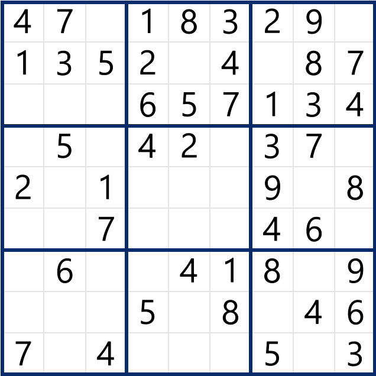

# learn_opencv
learn opencv

Practice CV

Face Detect
Camera
Video
Image Processing

## Image - Sudoku
视频演示：
<https://www.bilibili.com/video/BV14M41167AB>
1202 优化数独求解的代码，（最高难度级）目前平均用时0.1秒左右
自动完成一次游戏大概10秒（Microsoft Sudoku），我的B站有相关视频

### 直线

### 外轮廓

### 裁剪外轮廓

### 裁剪局部

### 识别

### 求解
